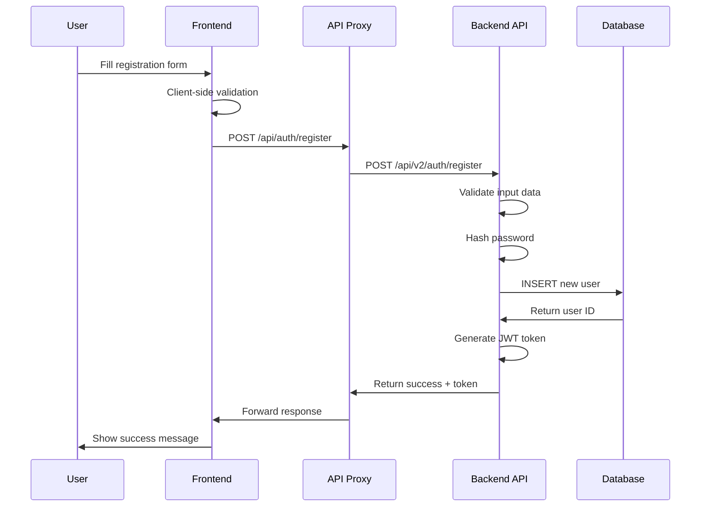
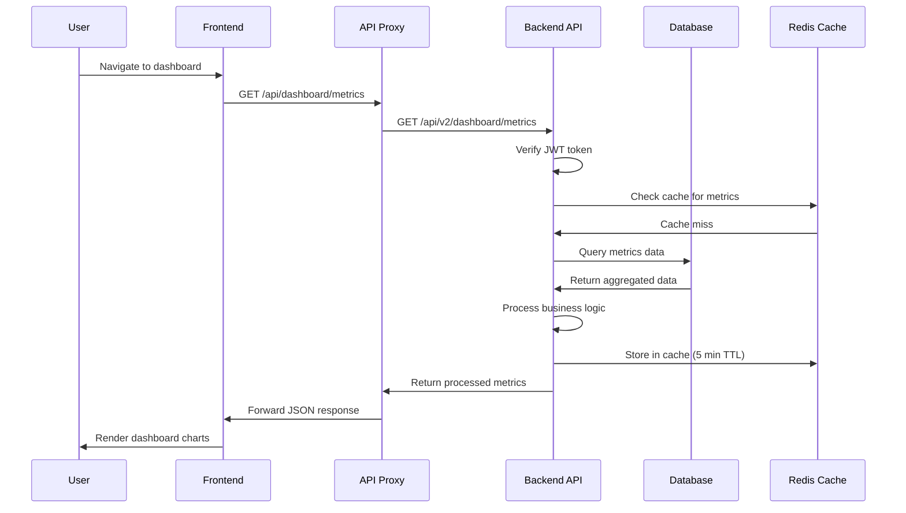
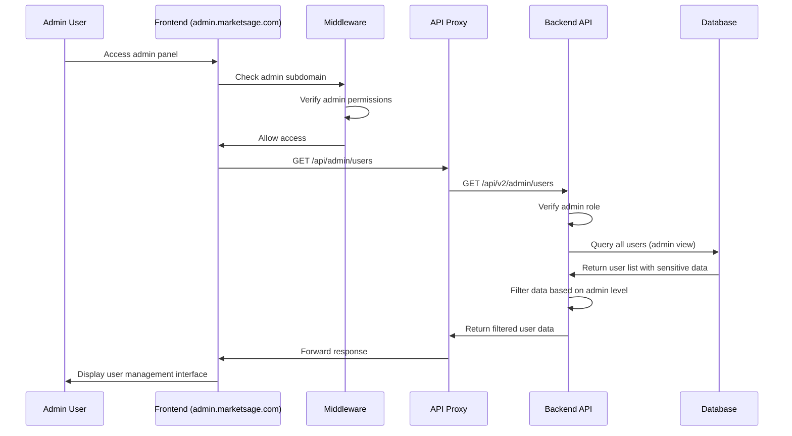
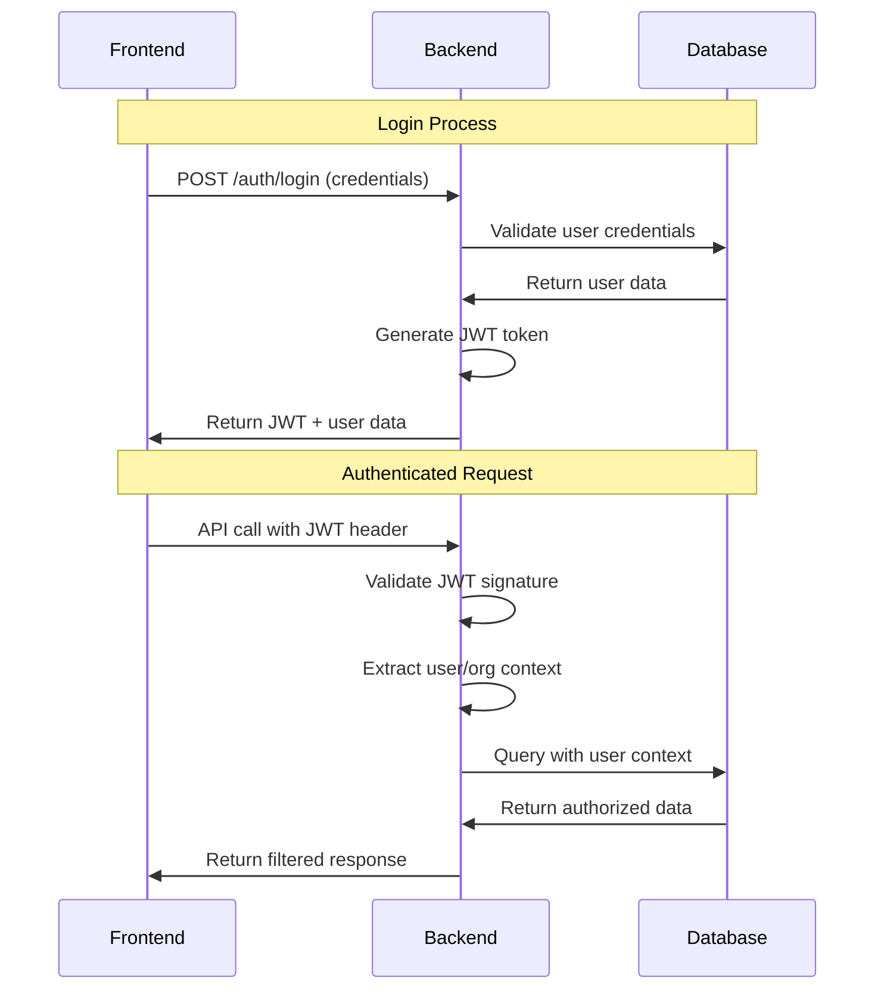
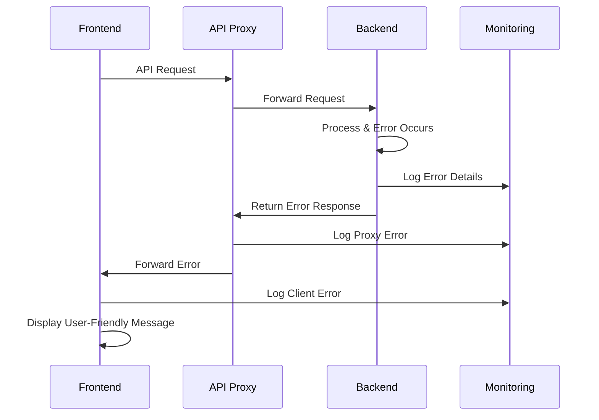

# MarketSage Data Flow Architecture

## Overview: Frontend → API → Database Pattern

MarketSage implements a strict separation of concerns where the frontend **never** directly accesses the database. All data operations flow through the NestJS backend API, ensuring security, consistency, and proper business logic enforcement.

```
┌─────────────────┐    ┌─────────────────┐    ┌─────────────────┐
│   Frontend      │    │   NestJS API    │    │   Database      │
│   (Next.js)     │───▶│   (Backend)     │───▶│   (PostgreSQL)  │
│                 │    │                 │    │                 │
│ - UI Components │    │ - Controllers   │    │ - User Data     │
│ - API Proxy     │    │ - Services      │    │ - Business Data │
│ - State Mgmt    │    │ - Validation    │    │ - Analytics     │
│ - User Actions  │    │ - Auth Guards   │    │ - Audit Logs    │
└─────────────────┘    └─────────────────┘    └─────────────────┘
        │                       │                       │
        │                       │                       │
        ▼                       ▼                       ▼
API Proxy Only          Business Logic           Single Source
No DB Access           & Data Processing         of Truth
```

## Data Flow Layers

### Layer 1: Frontend (Next.js Application)

#### Purpose
- **UI Rendering**: Display data to users
- **User Interaction**: Capture user input and actions
- **API Communication**: Proxy requests to backend
- **State Management**: Manage client-side application state

#### Key Components
```typescript
// Frontend API Route (Proxy Pattern)
// src/app/api/users/route.ts
export async function GET(request: NextRequest) {
  return proxyToBackend(request, {
    backendPath: 'users',
    requireAuth: true,
    enableLogging: process.env.NODE_ENV === 'development',
  });
}
```

#### Data Operations
- ✅ **Allowed**: API proxy calls, client state management, UI state
- ❌ **Forbidden**: Direct database queries, Prisma imports, SQL operations

#### Security Features
- JWT token forwarding
- CORS validation
- Request logging
- Error handling
- Rate limiting (client-side)

### Layer 2: API Gateway (NestJS Backend)

#### Purpose
- **Business Logic**: Implement core application logic
- **Data Validation**: Validate all incoming requests
- **Authentication**: Verify user permissions
- **Database Operations**: Perform all database interactions

#### Key Components
```typescript
// Backend Controller
// src/modules/users/users.controller.ts
@Controller('users')
@UseGuards(JwtAuthGuard)
export class UsersController {
  @Get()
  async findAll(@Req() req: Request) {
    // Business logic here
    return this.usersService.findAll(req.user.organizationId);
  }
}
```

#### Data Operations
- ✅ **Allowed**: Database queries, business logic, validation, caching
- ✅ **Required**: All CRUD operations must go through services
- ❌ **Forbidden**: Direct database exposure to frontend

### Layer 3: Database (PostgreSQL + Redis)

#### Purpose
- **Data Persistence**: Store application data securely
- **Data Integrity**: Enforce constraints and relationships
- **Performance**: Optimize queries and indexing
- **Backup & Recovery**: Maintain data availability

#### Access Pattern
- **Direct Access**: Only NestJS backend services
- **Connection Pool**: Managed by Prisma ORM
- **Security**: Role-based database permissions

## Detailed Data Flow Examples

### Example 1: User Registration Flow



### Example 2: Dashboard Data Loading Flow



### Example 3: Admin Portal User Management



## API Proxy Architecture

### Proxy Configuration
```typescript
// src/lib/api-proxy.ts
export async function proxyToBackend(
  request: NextRequest,
  options: ProxyOptions = {}
): Promise<NextResponse> {
  const {
    backendPath,
    requireAuth = false,
    enableLogging = false,
    timeout = 30000,
    retries = 1
  } = options;

  // 1. Extract and forward authentication
  const authHeader = request.headers.get('authorization');
  
  // 2. Build backend URL
  const backendUrl = `${process.env.NEXT_PUBLIC_BACKEND_URL}/api/v2/${backendPath}`;
  
  // 3. Forward request with enhanced headers
  const response = await fetch(backendUrl, {
    method: request.method,
    headers: {
      ...Object.fromEntries(request.headers.entries()),
      'x-forwarded-for': getClientIP(request),
      'x-original-host': request.headers.get('host') || '',
    },
    body: request.method !== 'GET' ? await request.text() : undefined,
  });

  // 4. Return response to frontend
  return new NextResponse(response.body, {
    status: response.status,
    headers: response.headers,
  });
}
```

### Request/Response Flow

#### Outbound Request (Frontend → Backend)
```json
{
  "method": "POST",
  "url": "/api/users",
  "headers": {
    "authorization": "Bearer jwt-token-here",
    "content-type": "application/json",
    "x-tenant-id": "org-123"
  },
  "body": {
    "name": "John Doe",
    "email": "john@example.com"
  }
}
```

#### Inbound Response (Backend → Frontend)
```json
{
  "status": 201,
  "headers": {
    "content-type": "application/json",
    "x-response-time": "45ms"
  },
  "body": {
    "success": true,
    "data": {
      "id": "user-456",
      "name": "John Doe",
      "email": "john@example.com",
      "createdAt": "2024-01-15T10:30:00Z"
    }
  }
}
```

## Database Access Patterns

### Single Responsibility: Backend Only

#### ✅ Correct Pattern: Via API
```typescript
// Frontend Component
const fetchUsers = async () => {
  const response = await fetch('/api/users', {
    headers: { 'Authorization': `Bearer ${token}` }
  });
  return response.json();
};
```

#### ❌ Incorrect Pattern: Direct DB Access
```typescript
// This is NEVER allowed in frontend
import { prisma } from '@/lib/prisma'; // ❌ FORBIDDEN
const users = await prisma.user.findMany(); // ❌ FORBIDDEN
```

### Backend Service Layer Pattern
```typescript
// Backend Service (Correct)
@Injectable()
export class UsersService {
  constructor(private prisma: PrismaService) {}

  async findAll(organizationId: string) {
    return this.prisma.user.findMany({
      where: { organizationId },
      select: {
        id: true,
        name: true,
        email: true,
        role: true,
        // Exclude sensitive fields
      }
    });
  }
}
```

## Authentication & Authorization Flow

### JWT Token Lifecycle


### Multi-Tenant Data Isolation
```typescript
// Backend: Automatic tenant filtering
@Injectable()
export class UsersService {
  async findAll(@CurrentUser() user: JwtPayload) {
    // All queries automatically scoped to user's organization
    return this.prisma.user.findMany({
      where: { 
        organizationId: user.organizationId // Auto-injected
      }
    });
  }
}
```

## Caching Strategy

### Multi-Layer Caching
```
Frontend Cache (Client)
├── React Query: API response caching
├── Local Storage: User preferences
└── Session Storage: Temporary state

API Cache (Backend)
├── Redis: Database query results
├── Memory: Configuration data
└── CDN: Static assets

Database Cache (PostgreSQL)
├── Query Plan Cache
├── Buffer Pool
└── Index Cache
```

### Cache Implementation
```typescript
// Backend caching example
@Injectable()
export class DashboardService {
  async getMetrics(organizationId: string) {
    const cacheKey = `metrics:${organizationId}`;
    
    // Try cache first
    const cached = await this.redis.get(cacheKey);
    if (cached) return JSON.parse(cached);
    
    // Fallback to database
    const metrics = await this.prisma.analytics.aggregate({
      where: { organizationId },
      _sum: { revenue: true, users: true }
    });
    
    // Cache for 5 minutes
    await this.redis.setex(cacheKey, 300, JSON.stringify(metrics));
    return metrics;
  }
}
```

## Error Handling & Monitoring

### Error Flow


### Error Response Structure
```json
{
  "success": false,
  "error": {
    "code": "VALIDATION_ERROR",
    "message": "Invalid email format",
    "details": {
      "field": "email",
      "value": "invalid-email"
    }
  },
  "timestamp": "2024-01-15T10:30:00Z",
  "requestId": "req-123"
}
```

## Performance Monitoring

### Key Metrics Tracked
- **Frontend**: Page load times, API call latency, error rates
- **API Proxy**: Request forwarding time, cache hit rates
- **Backend**: Database query time, business logic processing
- **Database**: Connection pool usage, query performance

### Monitoring Implementation
```typescript
// Backend performance tracking
@Injectable()
export class MetricsService {
  @InjectMetric('api_request_duration')
  private requestDuration: Histogram;

  async trackRequest(req: Request, res: Response, next: NextFunction) {
    const start = Date.now();
    
    res.on('finish', () => {
      const duration = Date.now() - start;
      this.requestDuration
        .labels(req.method, req.route?.path || 'unknown')
        .observe(duration);
    });
    
    next();
  }
}
```

## Security Implementation

### Request Security Headers
```typescript
// Middleware security headers
export function addSecurityHeaders(response: NextResponse) {
  response.headers.set('X-Content-Type-Options', 'nosniff');
  response.headers.set('X-Frame-Options', 'DENY');
  response.headers.set('X-XSS-Protection', '1; mode=block');
  response.headers.set('Referrer-Policy', 'strict-origin-when-cross-origin');
  
  // Content Security Policy
  const csp = [
    "default-src 'self'",
    "script-src 'self' 'unsafe-inline'",
    "style-src 'self' 'unsafe-inline'",
    "connect-src 'self' https://api.marketsage.com"
  ].join('; ');
  response.headers.set('Content-Security-Policy', csp);
  
  return response;
}
```

### Data Validation Pipeline
```typescript
// Backend validation
@Controller('users')
export class UsersController {
  @Post()
  @UsePipes(new ValidationPipe())
  async create(@Body() createUserDto: CreateUserDto) {
    // DTO automatically validates:
    // - Email format
    // - Required fields
    // - Data types
    // - Custom business rules
    return this.usersService.create(createUserDto);
  }
}
```

## Summary: Benefits of This Architecture

### 🔒 Security Benefits
- **No SQL Injection Risk**: Frontend never constructs SQL queries
- **Centralized Authentication**: Single point of auth validation
- **Data Access Control**: Backend enforces all permissions
- **Input Validation**: Consistent validation at API layer

### 🚀 Performance Benefits
- **Optimized Queries**: Backend can optimize database operations
- **Caching Strategy**: Multi-layer caching reduces database load
- **Connection Pooling**: Efficient database connection management
- **CDN Support**: Static assets served from edge locations

### 🛠 Maintenance Benefits
- **Single Source of Truth**: Business logic centralized in backend
- **API Versioning**: Clean evolution of APIs over time
- **Testing Strategy**: Clear separation enables targeted testing
- **Monitoring**: Comprehensive observability at each layer

### 📈 Scalability Benefits
- **Horizontal Scaling**: Frontend and backend scale independently
- **Database Optimization**: Centralized query optimization
- **Microservices Ready**: Architecture supports future service separation
- **Load Balancing**: Traffic distributed across multiple instances

This architecture ensures MarketSage maintains security, performance, and maintainability while providing a clear path for future microservices evolution.