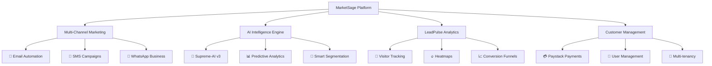
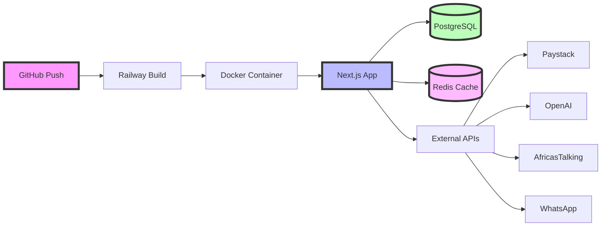
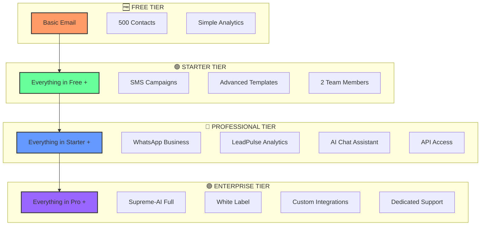
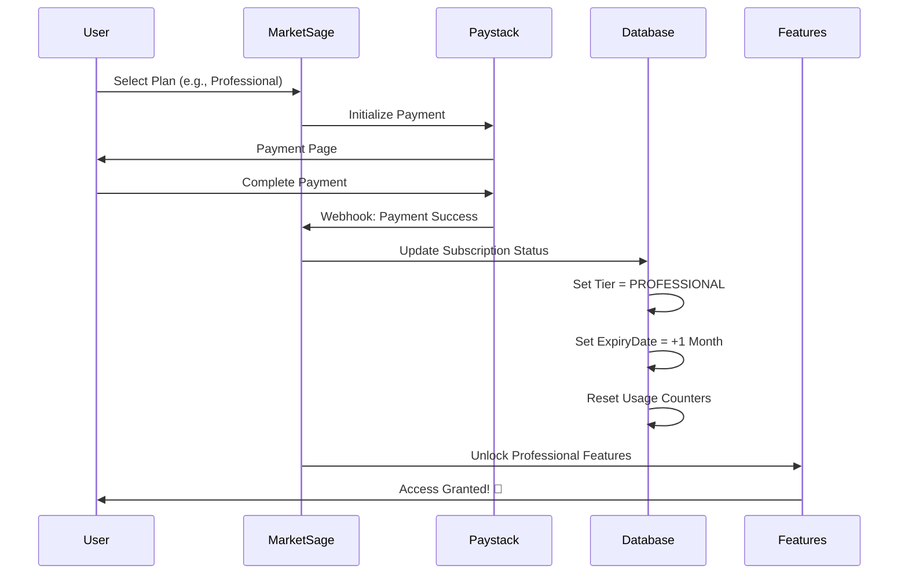
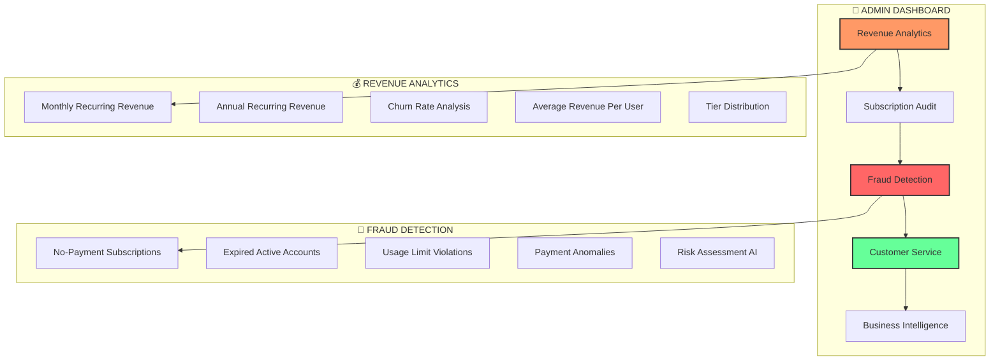

# 🚀 MarketSage Deployment & Monetization Masterplan

<div align="center">
  
  
  
</div>

---

## 📋 Table of Contents

1. [🏗️ Application Overview](#-application-overview)
2. [🚂 Railway Deployment Strategy](#-railway-deployment-strategy)
3. [💰 SaaS Pricing Tiers](#-saas-pricing-tiers)
4. [🔐 Automatic Subscription System](#-automatic-subscription-system)
5. [👑 Admin Dashboard & Customer Service](#-admin-dashboard--customer-service)
6. [🧪 Testing Strategy](#-testing-strategy)
7. [🌍 African Market Optimization](#-african-market-optimization)
8. [📊 Post-Deployment Monitoring](#-post-deployment-monitoring)
9. [🎯 Next Steps & Timeline](#-next-steps--timeline)

---

## 🏗️ Application Overview

<div align="center">



</div>

### 🎯 **Key Features**
| Feature | Description | Status |
|---------|-------------|--------|
| 🚀 **130+ API Endpoints** | Comprehensive REST API | ✅ Ready |
| 🤖 **AI-Powered Intelligence** | Supreme-AI v3 with GPT-4 | ✅ Ready |
| 📊 **Real-time Analytics** | LeadPulse visitor tracking | ✅ Ready |
| 💬 **Multi-channel Support** | Email, SMS, WhatsApp | ✅ Ready |
| 🌍 **African Market Focus** | Local providers & compliance | ✅ Ready |
| 💳 **Payment Integration** | Paystack subscription billing | ✅ Ready |

---

## 🚂 Railway Deployment Strategy

### 🔧 **Pre-Deployment Checklist**

<div align="center">

| Step | Task | Command/Action | Status |
|------|------|---------------|--------|
| 1️⃣ | **Create Railway Account** | [railway.app](https://railway.app) | ⏳ |
| 2️⃣ | **Connect GitHub Repo** | Link `marketsage` repository | ⏳ |
| 3️⃣ | **Add PostgreSQL** | `railway add postgresql` | ⏳ |
| 4️⃣ | **Add Redis** | `railway add redis` | ⏳ |
| 5️⃣ | **Configure Environment** | Set all env variables | ⏳ |
| 6️⃣ | **Deploy Application** | Auto-deploy on push | ⏳ |
| 7️⃣ | **Run Migrations** | `npx prisma db push` | ⏳ |
| 8️⃣ | **Seed Database** | `npm run seed-all` | ⏳ |

</div>

### 🔐 **Required Environment Variables**

```bash
# 🔑 Core Configuration
NODE_ENV=production
DATABASE_URL=postgresql://[auto-generated-by-railway]
REDIS_URL=redis://[auto-generated-by-railway]

# 🔐 Authentication
NEXTAUTH_SECRET=your-super-secret-jwt-key-min-32-chars
NEXTAUTH_URL=https://your-app.railway.app
JWT_SECRET=another-secret-key-for-tokens

# 🤖 AI Configuration
OPENAI_API_KEY=sk-...your-openai-key
SUPREME_AI_MODE=enabled
OPENAI_MODEL=gpt-4o-mini

# 📧 Email Configuration (Zoho Pro)
EMAIL_PROVIDER=smtp
SMTP_HOST=smtppro.zoho.com
SMTP_PORT=465
SMTP_SECURE=true
SMTP_USER=info@marketsage.africa
SMTP_PASS=your-zoho-password

# 💳 Payment Configuration
PAYSTACK_SECRET_KEY=sk_live_...
PAYSTACK_PUBLIC_KEY=pk_live_...

# 📱 SMS Configuration
AFRICASTALKING_API_KEY=your-api-key
AFRICASTALKING_USERNAME=marketsage
TERMII_API_KEY=your-termii-key

# 🔒 Security
FIELD_ENCRYPTION_KEY=32-character-encryption-key-here
MASTER_ENCRYPTION_KEY=another-32-char-key
```

### 🚀 **Deployment Architecture**

<div align="center">



</div>

---

## 💰 SaaS Pricing Tiers

<div align="center">

### 🎯 **Tiered Pricing Strategy**

| Feature | 🆓 **FREE** | 🟢 **STARTER** | 🔵 **PROFESSIONAL** | 🟣 **ENTERPRISE** |
|---------|------------|----------------|---------------------|-------------------|
| **Price** | **₦0** | **₦15,000/mo** | **₦45,000/mo** | **₦120,000/mo** |
| | $0 | ~$35 | ~$100 | ~$270 |
| **Contacts** | 500 | 2,500 | 10,000 | Unlimited |
| **Email/Month** | 1,000 | 10,000 | 50,000 | Unlimited |
| **SMS Credits** | ❌ | 500 | 2,000 | 10,000 |
| **WhatsApp** | ❌ | ❌ | ✅ 1,000 | ✅ 5,000 |
| **LeadPulse** | ❌ | ❌ | ✅ 50k visits | ✅ Unlimited |
| **AI Features** | ❌ | ❌ | 🤖 Basic | 🤖 Full Suite |
| **Team Members** | 1 | 2 | 10 | Unlimited |
| **Support** | Email | Email | Priority | Dedicated |
| **API Access** | ❌ | ❌ | ✅ Limited | ✅ Full |
| **White Label** | ❌ | ❌ | ❌ | ✅ |

</div>

### 📊 **Feature Comparison Visual**

<div align="center">



</div>

---

## 🔐 Automatic Subscription System

### ⚙️ **How It Works**

<div align="center">



</div>

### 🎯 **Implementation Details**

#### **1. Database Schema Updates**
```sql
-- Subscription tracking
ALTER TABLE "Organization" ADD:
  - subscriptionTier (FREE/STARTER/PROFESSIONAL/ENTERPRISE)
  - subscriptionExpiresAt (timestamp)
  - gracePeriodEndsAt (timestamp)
  - featureUsage (JSON - tracks monthly usage)
```

#### **2. Automatic Permission Granting**
```typescript
// When payment confirmed via webhook
async function onPaymentSuccess(transaction) {
  // 1. Update subscription status
  await updateSubscription(organizationId, "ACTIVE");
  
  // 2. Set tier and expiry
  await setOrganizationTier(organizationId, plan.tier, {
    expiresAt: addMonths(now, 1),
    gracePeriod: addDays(expiresAt, 7)
  });
  
  // 3. Reset usage counters
  await resetMonthlyUsage(organizationId);
  
  // 4. Features automatically unlocked!
}
```

#### **3. Feature Protection Middleware**
```typescript
// Protect any API route
export const POST = withSubscription(
  yourHandler,
  { 
    feature: "aiChatEnabled",
    minimumTier: "PROFESSIONAL"
  }
);

// Track usage automatically
export const sendSMS = withSubscription(
  smsHandler,
  { 
    usageType: "sms",
    incrementUsage: recipientCount
  }
);
```

### 📊 **Usage Tracking Dashboard**

<div align="center">

| Metric | Visual | Limit Enforcement |
|--------|--------|-------------------|
| 📧 **Emails** | Progress Bar | Auto-block at limit |
| 📱 **SMS** | Progress Bar | Auto-block at limit |
| 💬 **WhatsApp** | Progress Bar | Auto-block at limit |
| 👥 **LeadPulse** | Progress Bar | Auto-block at limit |

</div>

---

## 🧪 Testing Strategy

### 🎯 **Post-Deployment Testing Workflow**

```mermaid
graph LR
    subgraph "Day 1: Infrastructure"
        A1[Health Check] --> A2[Auth Test]
        A2 --> A3[Database Seed]
        A3 --> A4[API Tests]
    end
    
    subgraph "Day 2: Integration"
        B1[Create Test Site] --> B2[Install LeadPulse]
        B2 --> B3[Track Visitors]
        B3 --> B4[Test Forms]
    end
    
    subgraph "Day 3: Full E2E"
        C1[Lead Capture] --> C2[Email Campaign]
        C2 --> C3[SMS Follow-up]
        C3 --> C4[Analytics Check]
    end
    
    A4 --> B1
    B4 --> C1
    
    style A1 fill:#f96,stroke:#333,stroke-width:2px
    style B1 fill:#69f,stroke:#333,stroke-width:2px
    style C1 fill:#6f9,stroke:#333,stroke-width:2px
```

<div align="center">



</div>

### 🌐 **Test Website Integration**

#### **Simple HTML Test Site**
```html
<!DOCTYPE html>
<html>
<head>
    <title>MarketSage Test E-commerce</title>
    <script src="https://your-app.railway.app/leadpulse/tracker.js"></script>
    <style>
        body { font-family: Arial; padding: 20px; }
        .product { border: 1px solid #ddd; padding: 20px; margin: 10px; }
        button { background: #4CAF50; color: white; padding: 10px; }
    </style>
</head>
<body>
    <h1>🛍️ Nigerian Tech Store</h1>
    
    <!-- Lead Capture Form -->
    <form id="leadForm">
        <h2>Get 10% Off Your First Order!</h2>
        <input type="email" placeholder="Email" required>
        <input type="text" placeholder="Full Name" required>
        <input type="tel" placeholder="+234..." required>
        <button type="submit">Get Discount Code</button>
    </form>
    
    <!-- Test Products -->
    <div class="products">
        <div class="product">
            <h3>iPhone 15 Pro</h3>
            <p>₦1,200,000</p>
            <button onclick="trackProduct('iphone-15')">View Details</button>
            <button onclick="addToCart('iphone-15', 1200000)">Add to Cart</button>
        </div>
        
        <div class="product">
            <h3>MacBook Pro M3</h3>
            <p>₦2,500,000</p>
            <button onclick="trackProduct('macbook-m3')">View Details</button>
            <button onclick="addToCart('macbook-m3', 2500000)">Add to Cart</button>
        </div>
    </div>
    
    <script>
        // Initialize LeadPulse
        LeadPulse.init({
            trackingId: 'your-tracking-id',
            apiUrl: 'https://your-app.railway.app'
        });
        
        // Track page view
        LeadPulse.track('page_view', {
            page: 'homepage',
            source: document.referrer || 'direct'
        });
        
        // Form submission
        document.getElementById('leadForm').addEventListener('submit', async (e) => {
            e.preventDefault();
            const formData = new FormData(e.target);
            
            LeadPulse.track('lead_capture', {
                email: formData.get('email'),
                name: formData.get('name'),
                phone: formData.get('phone'),
                source: 'discount_form'
            });
            
            alert('✅ Discount code sent to your email!');
        });
        
        // Product tracking
        function trackProduct(productId) {
            LeadPulse.track('product_view', {
                productId,
                timestamp: new Date()
            });
        }
        
        function addToCart(productId, price) {
            LeadPulse.track('add_to_cart', {
                productId,
                value: price,
                currency: 'NGN'
            });
            alert('✅ Added to cart!');
        }
    </script>
</body>
</html>
```

### 📱 **SMS/WhatsApp Testing with Nigerian Numbers**

```javascript
// Test Configuration
const nigerianTestCases = [
  {
    carrier: "MTN",
    numbers: ["+2348030000001", "+2348060000001"],
    expectedDelivery: ">95%"
  },
  {
    carrier: "Airtel", 
    numbers: ["+2347020000001", "+2348020000001"],
    expectedDelivery: ">93%"
  },
  {
    carrier: "Glo",
    numbers: ["+2348050000001", "+2349050000001"],
    expectedDelivery: ">90%"
  },
  {
    carrier: "9mobile",
    numbers: ["+2348090000001", "+2349090000001"],
    expectedDelivery: ">88%"
  }
];

// Run carrier-specific tests
async function testNigerianSMS() {
  for (const test of nigerianTestCases) {
    console.log(`Testing ${test.carrier}...`);
    
    const results = await sendTestSMS({
      to: test.numbers,
      message: "MarketSage test SMS. Reply STOP to opt out.",
      sender: "MarketSage"
    });
    
    console.log(`✅ ${test.carrier} delivery:`, results.successRate);
  }
}
```

---

## 🌍 African Market Optimization

### 📱 **Local Provider Integrations**

<div align="center">

| Provider | Service | Coverage | Integration Status |
|----------|---------|----------|-------------------|
| 🟢 **AfricasTalking** | SMS/USSD | 17 African countries | ✅ Integrated |
| 🔵 **Termii** | SMS/Voice | Nigeria focus | ✅ Integrated |
| 🟣 **Paystack** | Payments | Nigeria, Ghana, SA | ✅ Integrated |
| ⚪ **Twilio** | SMS/WhatsApp | Global backup | ✅ Integrated |

</div>

### 💡 **Performance Optimizations**

```javascript
// Mobile-first optimizations
const africanOptimizations = {
  // 1. Image compression for slow networks
  images: {
    quality: 60,
    format: 'webp',
    lazy: true
  },
  
  // 2. Offline support
  offline: {
    cacheStrategy: 'network-first',
    syncInterval: 300000 // 5 minutes
  },
  
  // 3. Local currency display
  currencies: ['NGN', 'GHS', 'KES', 'ZAR'],
  
  // 4. SMS fallback for email
  communicationFallback: {
    primary: 'email',
    secondary: 'sms',
    tertiary: 'whatsapp'
  }
};
```

---

## 📊 Post-Deployment Monitoring

### 🎯 **Key Metrics Dashboard**

```mermaid
graph TB
    subgraph "Business Metrics"
        B1[Active Users] --> B2[MRR/ARR]
        B2 --> B3[Churn Rate]
        B3 --> B4[LTV]
    end
    
    subgraph "Technical Metrics"
        T1[Uptime %] --> T2[Response Time]
        T2 --> T3[Error Rate]
        T3 --> T4[API Usage]
    end
    
    subgraph "Marketing Metrics"
        M1[Email Delivery] --> M2[SMS Success]
        M2 --> M3[WhatsApp Read]
        M3 --> M4[Conversion Rate]
    end
    
    style B1 fill:#6f9,stroke:#333,stroke-width:2px
    style T1 fill:#69f,stroke:#333,stroke-width:2px
    style M1 fill:#f96,stroke:#333,stroke-width:2px
```

<div align="center">



</div>

### 📈 **Success Criteria**

| Metric | Target | Alert Threshold |
|--------|--------|-----------------|
| 🟢 **Uptime** | >99.5% | <99% |
| ⚡ **Response Time** | <2s | >3s |
| ❌ **Error Rate** | <1% | >2% |
| 📧 **Email Delivery** | >95% | <90% |
| 📱 **SMS Delivery** | >90% | <85% |
| 💰 **Payment Success** | >98% | <95% |

---

## 🎯 Next Steps & Timeline

### 📅 **Week 1: Foundation**
- [ ] Day 1: Railway account setup
- [ ] Day 2: Environment configuration
- [ ] Day 3: Initial deployment
- [ ] Day 4: Database migration & seeding
- [ ] Day 5: Health checks & monitoring
- [ ] Day 6-7: Bug fixes & optimization

### 📅 **Week 2: Integration Testing**
- [ ] Day 8-9: External website creation
- [ ] Day 10: LeadPulse integration testing
- [ ] Day 11: Payment flow testing
- [ ] Day 12: SMS/WhatsApp testing
- [ ] Day 13-14: Load testing & optimization

### 📅 **Week 3: Go Live**
- [ ] Day 15: Soft launch (beta users)
- [ ] Day 16-17: Monitor & fix issues
- [ ] Day 18: Marketing site update
- [ ] Day 19: Documentation finalization
- [ ] Day 20-21: Full public launch! 🎉

---

## 👑 Admin Dashboard & Customer Service

### 🎯 **Comprehensive Business Intelligence System**

<div align="center">



</div>

### 📊 **Real-Time Business Metrics**

<div align="center">

| **Revenue Tracking** | **Customer Analytics** | **Risk Management** | **Operational Metrics** |
|---------------------|------------------------|---------------------|------------------------|
| 💰 **MRR/ARR** | 👥 **Active Subscriptions** | 🚨 **High Risk Accounts** | ⚡ **Payment Failures** |
| Real-time revenue | Live subscriber count | Auto-flagged issues | Failed transaction rate |
| 📈 **Growth Rate** | 🔄 **Churn Analysis** | ⚠️ **Medium Risk** | 🔔 **Renewal Alerts** |
| Month-over-month | Customer retention | Usage violations | Upcoming renewals |
| 💎 **ARPU** | 🎯 **Tier Distribution** | ✅ **Low Risk** | 📞 **Support Tickets** |
| Average revenue/user | Premium vs basic users | Healthy accounts | CS workload tracking |

</div>

### 🛠️ **Customer Service Action Center**

#### **1. Subscription Management Tools**
```typescript
// Available Customer Service Actions
const customerServiceActions = {
  // Subscription Verification
  verifyPayment: "Manually verify disputed payments",
  approveSubscription: "Approve legitimate subscriptions", 
  suspendAccount: "Suspend fraudulent accounts",
  downgradeUser: "Move abusive users to FREE tier",
  
  // Customer Support
  extendTrial: "Extend trial periods for legitimate customers",
  refundPayment: "Process refunds for billing issues",
  resetUsage: "Reset monthly usage counters",
  unlockFeatures: "Temporarily unlock features for CS",
  
  // Account Recovery
  recoverAccount: "Help customers recover locked accounts",
  mergeAccounts: "Merge duplicate customer accounts",
  transferOwnership: "Transfer org ownership",
  dataExport: "Export customer data for GDPR requests"
};
```

#### **2. Fraud Detection Dashboard**
<div align="center">

| **Risk Level** | **Auto-Detection** | **CS Action Required** |
|---------------|-------------------|----------------------|
| 🔴 **HIGH RISK** | No payment + active subscription | Immediate suspension |
| 🔴 **HIGH RISK** | Multiple failed payments | Contact customer |
| 🟡 **MEDIUM RISK** | Usage 90%+ of tier limit | Upgrade recommendation |
| 🟡 **MEDIUM RISK** | Late payment patterns | Payment reminder |
| 🟢 **LOW RISK** | Normal usage patterns | No action needed |

</div>

#### **3. Customer Service Dashboard Features**

**📈 Live Analytics View:**
```bash
💰 Today's Revenue: ₦145,000
👥 Active Subscribers: 1,247
🚨 Issues Pending: 8
📞 Support Tickets: 12

Recent Activity:
✅ Approved subscription: enterprise-customer-001
❌ Suspended fraudulent account: fake-user-123  
🔄 Processed refund: ₦45,000 for billing error
📧 Sent upgrade reminder to 23 customers
```

**🎯 Customer 360° View:**
- **Subscription History**: Complete payment timeline
- **Usage Analytics**: Feature consumption patterns  
- **Support History**: Previous tickets and resolutions
- **Risk Assessment**: AI-powered fraud scoring
- **Account Health**: Payment reliability metrics

#### **4. Automated Issue Detection**

```javascript
// Real-time monitoring alerts
const automaticAlerts = {
  fraudDetection: {
    "No Payment Active Subscription": "🚨 HIGH - Suspend immediately",
    "Expired Still Marked Paid": "⚠️ MEDIUM - Downgrade to FREE", 
    "Usage Exceeds Tier Limit": "💡 LOW - Suggest upgrade",
    "Multiple Payment Failures": "🔄 MEDIUM - Payment assistance"
  },
  
  businessIntelligence: {
    "Churn Rate Spike": "📉 Monitor customer satisfaction",
    "Revenue Drop": "📊 Analyze tier downgrades", 
    "Support Ticket Surge": "🎧 Increase CS capacity",
    "Payment Gateway Issues": "💳 Check provider status"
  }
};
```

### 🎧 **Customer Service Workflow**

#### **Daily CS Operations:**
1. **Morning Dashboard Review** (9:00 AM)
   - Check overnight payment failures
   - Review high-risk account flags
   - Monitor revenue metrics

2. **Issue Triage** (Throughout day)
   - Process subscription disputes
   - Handle billing inquiries  
   - Resolve account access issues

3. **Proactive Outreach** (Afternoon)
   - Contact high-risk customers
   - Send upgrade recommendations
   - Follow up on payment failures

4. **End-of-Day Reporting** (6:00 PM)
   - Close resolved tickets
   - Escalate complex issues
   - Update customer notes

#### **Access Control for Customer Service:**
```typescript
// CS Team Permissions
const customerServicePermissions = {
  canView: [
    "customer_subscriptions",
    "payment_history", 
    "usage_analytics",
    "support_tickets"
  ],
  canModify: [
    "subscription_status",
    "trial_extensions",
    "usage_resets",
    "customer_notes"
  ],
  cannotAccess: [
    "admin_settings",
    "system_configuration",
    "user_passwords",
    "financial_reports"
  ]
};
```

### 🔐 **Admin vs Customer Service Access**

<div align="center">

| **Feature** | **👑 Super Admin** | **🛡️ Admin** | **🎧 Customer Service** |
|-------------|-------------------|---------------|-------------------------|
| **Revenue Analytics** | ✅ Full Access | ✅ Full Access | ✅ View Only |
| **Subscription Management** | ✅ All Actions | ✅ All Actions | ✅ Limited Actions |
| **User Account Access** | ✅ Complete | ✅ Complete | ✅ Customer Data Only |
| **System Configuration** | ✅ Full Control | ❌ No Access | ❌ No Access |
| **Financial Reports** | ✅ All Reports | ✅ Standard Reports | ❌ No Access |
| **Audit Trail** | ✅ View All | ✅ View All | ✅ Own Actions Only |

</div>

### 📱 **Admin Dashboard Access**

#### **URL Access:**
```bash
# Production (Railway)
https://your-app.railway.app/dashboard/admin/subscriptions
https://your-app.railway.app/dashboard/customer-service

# Local Docker Testing
http://localhost:3030/dashboard/admin/subscriptions
http://localhost:3030/dashboard/customer-service
```

#### **Login Credentials:**
```bash
# Super Admin
Email: supreme@marketsage.africa
Password: MS_Super2025!

# Admin Manager
Email: anita@marketsage.africa  
Password: MS_Admin2025!

# IT Admin
Email: kola@marketsage.africa
Password: MS_ITAdmin2025!
```

### 🐳 **Docker Testing Guide**

#### **1. Starting Docker Environment**
```bash
# Navigate to project directory
cd /path/to/marketsage

# Start the complete stack
docker-compose -f docker-compose.prod.yml up -d

# Wait for database seeding to complete (check logs)
docker-compose logs -f seed
```

#### **2. Admin Dashboard Testing Workflow**

**Step 1: Basic Access Test**
```bash
# 1. Open browser and go to:
http://localhost:3030/login

# 2. Login with admin credentials
Email: supreme@marketsage.africa
Password: MS_Super2025!

# 3. Navigate to admin dashboard:
http://localhost:3030/dashboard/admin/subscriptions

# 4. Should see revenue analytics and subscription list
```

**Step 2: Dashboard Features Verification**
<div align="center">

| **Feature** | **What to Check** | **Expected Result** |
|-------------|-------------------|-------------------|
| 💰 **Revenue Analytics** | MRR, ARR, churn rate cards | Real-time metrics display |
| 👥 **Subscription List** | Customer table with tiers | All seeded subscriptions visible |
| 🚨 **Risk Assessment** | HIGH/MEDIUM/LOW flags | Auto-calculated risk levels |
| 📊 **Tier Distribution** | Visual chart | Subscription breakdown |
| 🔍 **Fraud Detection** | Issues alert section | Flagged problematic accounts |

</div>

**Step 3: Admin Actions Testing**
```bash
# Test Customer Service Actions:
1. Click "View" button on any subscription
2. Test admin actions in modal:
   ✅ APPROVE subscription
   ✅ SUSPEND fraudulent account  
   ✅ DOWNGRADE to FREE tier
3. Verify actions are logged with reason
4. Check subscription status updates
```

#### **3. API Endpoints Testing**
```bash
# Test admin API endpoints directly
curl http://localhost:3030/api/admin/subscriptions/audit
curl http://localhost:3030/api/admin/subscriptions/analytics  
curl http://localhost:3030/api/admin/subscriptions/verify

# Expected responses:
# - audit: Complete subscription data with risk assessment
# - analytics: Revenue metrics (MRR, ARR, churn)
# - verify: List of subscription integrity issues
```

#### **4. Role-Based Access Testing**
```bash
# Test different user permissions:

# SUPER_ADMIN (supreme@marketsage.africa)
✅ Full admin dashboard access
✅ All subscription actions available
✅ Complete revenue analytics
✅ System configuration access

# ADMIN (anita@marketsage.africa)  
✅ Full admin dashboard access
✅ All subscription actions available
✅ Standard revenue reports
❌ System configuration blocked

# IT_ADMIN (kola@marketsage.africa)
✅ Full admin dashboard access
✅ Technical system monitoring
✅ Limited financial data
❌ Subscription modification limited

# Regular USER
❌ Admin dashboard blocked (should redirect)
❌ Admin API endpoints return 403
❌ Only customer-facing features accessible
```

#### **5. Expected Dashboard Sections**
```bash
📊 Revenue Analytics Section:
💰 Monthly Recurring Revenue: ₦X,XXX,XXX
👥 Active Subscriptions: XXX
📉 Churn Rate: X.X%
🚨 Issues Requiring Attention: X

📈 Tier Distribution Chart:
🟣 ENTERPRISE: XX subscribers (₦X,XXX,XXX/mo)
🔵 PROFESSIONAL: XX subscribers (₦XXX,XXX/mo)  
🟢 STARTER: XX subscribers (₦XX,XXX/mo)
⚪ FREE: XX subscribers

🚨 Risk Assessment Alerts:
🔴 HIGH RISK: X accounts (immediate action required)
🟡 MEDIUM RISK: X accounts (monitor closely)
🟢 LOW RISK: XXX accounts (healthy)

📋 Subscription Audit Table:
- Organization name and primary user email
- Current subscription tier and status
- Revenue metrics (total and monthly)
- Expiry dates and renewal information
- Usage statistics and risk assessment
- Actionable buttons for customer service
```

#### **6. Troubleshooting Common Issues**

**Dashboard Not Loading:**
```bash
# Check Docker container status
docker-compose ps

# Check web application logs
docker-compose logs web

# Verify database connection
docker-compose logs marketsage-db
```

**Admin Access Denied:**
```bash
# Verify user role in database
docker-compose exec marketsage-db psql -U marketsage -d marketsage \
  -c "SELECT email, role FROM \"User\" WHERE email = 'supreme@marketsage.africa';"

# Check authentication logs
docker-compose logs web | grep "Auth"
```

**Missing Subscription Data:**
```bash
# Check if seeding completed successfully
docker-compose logs seed

# Verify subscription data exists
docker-compose exec marketsage-db psql -U marketsage -d marketsage \
  -c "SELECT COUNT(*) FROM \"Subscription\";"

# Re-run seeding if needed
docker-compose restart seed
```

**API Endpoints Not Working:**
```bash
# Test health endpoint first
curl http://localhost:3030/api/health

# Check API route logs
docker-compose logs web | grep "api/admin"

# Verify Redis connection for session management
docker-compose logs marketsage-valkey
```

#### **7. Performance Testing**
```bash
# Load testing with multiple admin users
# Test concurrent admin dashboard access
# Monitor resource usage during peak admin activity
# Verify response times for large subscription datasets

# Expected performance benchmarks:
- Dashboard load time: <3 seconds
- API response time: <1 second  
- Subscription list rendering: <2 seconds
- Admin action execution: <1 second
```

### 🎯 **Business Impact Metrics**

#### **Customer Service KPIs:**
- **Ticket Resolution Time**: Target <2 hours
- **Customer Satisfaction**: Target >4.5/5
- **First Contact Resolution**: Target >80%
- **Subscription Recovery Rate**: Target >60%

#### **Revenue Protection:**
- **Fraud Prevention Savings**: Track prevented losses
- **Churn Reduction**: Monitor retention improvements  
- **Upsell Success Rate**: CS-driven upgrades
- **Payment Recovery**: Dunning management success

---

## 🚀 **Final Launch Checklist**

<div align="center">

| Component | Status | Notes |
|-----------|--------|-------|
| 🏗️ **Infrastructure** | ⏳ | Railway + PostgreSQL + Redis |
| 🔐 **Authentication** | ✅ | NextAuth + Role-based |
| 💳 **Payments** | ✅ | Paystack integrated |
| 📧 **Email System** | ✅ | Zoho Pro configured |
| 📱 **SMS System** | ✅ | AfricasTalking + Termii |
| 💬 **WhatsApp** | ✅ | Business API ready |
| 🤖 **AI Features** | ✅ | OpenAI integrated |
| 📊 **Analytics** | ✅ | LeadPulse active |
| 👑 **Admin Dashboard** | ✅ | Complete subscription management |
| 🎧 **Customer Service** | ✅ | Fraud detection & support tools |
| 🎨 **UI/UX** | ✅ | Responsive & optimized |
| 📚 **Documentation** | ✅ | Complete |

</div>

---

<div align="center">

## 🎉 **MarketSage is Ready for Launch!**

### **Enterprise-Grade Marketing Automation for Africa**


</div>

---

## 📞 **Support & Contact**

- 📧 **Email**: support@marketsage.africa
- 💬 **WhatsApp**: +234-xxx-xxx-xxxx
- 🌐 **Website**: https://marketsage.africa
- 📚 **Docs**: https://docs.marketsage.africa

---

*This document represents the complete deployment and monetization strategy for MarketSage, covering everything from technical deployment to business model implementation.*