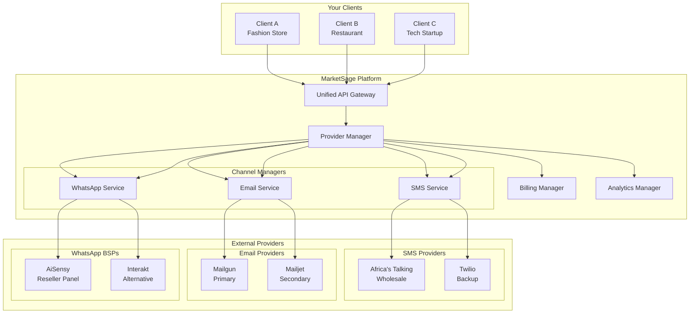

# 🚀 MarketSage Multi-Tenant Messaging Strategy
## Complete Guide for SMS, Email & WhatsApp Business Integration

---

## 📋 Table of Contents
1. [Executive Summary](#executive-summary)
2. [Current Situation Analysis](#current-situation-analysis)
3. [Recommended Architecture](#recommended-architecture)
4. [Channel-Specific Strategies](#channel-specific-strategies)
5. [Provider Comparison & Recommendations](#provider-comparison)
6. [Implementation Roadmap](#implementation-roadmap)
7. [Financial Projections](#financial-projections)
8. [Technical Implementation Guide](#technical-implementation)
9. [Risk Management](#risk-management)
10. [Success Metrics](#success-metrics)

---

## 🎯 Executive Summary

### Vision
Transform MarketSage into a **comprehensive multi-tenant messaging platform** where clients can send SMS, Email, and WhatsApp messages under their own brand identity, while you manage the infrastructure and earn significant margins.

### Key Business Model
- **You**: Infrastructure provider & aggregator
- **Your Clients**: End users with their own branding
- **Revenue Model**: Wholesale → Retail markup (50-200%)

### Expected Outcomes
- 💰 **Revenue**: $10K-50K+ monthly recurring revenue
- 🏢 **Clients**: 100+ businesses within 6 months
- 📈 **Margins**: 50-200% on messaging services
- 🌍 **Market**: Dominate African market messaging

---

## 📊 Current Situation Analysis

### What You Have ✅
```
✓ SMS: Multi-provider architecture (Twilio, Africa's Talking)
✓ Email: Basic SMTP integration (Zoho for testing)
✓ WhatsApp: API structure ready
✓ Database: Organization-based provider system
✓ Authentication: Secure multi-tenant structure
```

### What You Need 🎯
```
❗ Email: Professional white-label solution
❗ WhatsApp: BSP partnership
❗ SMS: Reseller agreements
❗ Billing: Usage-based charging
❗ Branding: Custom sender identities
```

---

## 🏗️ Recommended Architecture

### Multi-Tenant Messaging Platform Architecture



---

## 📱 Channel-Specific Strategies

### 1. SMS Strategy 📨

#### Recommended Approach: **Aggregator/Reseller Model**

| Provider | Best For | Wholesale Price | Retail Price | Your Margin |
|----------|----------|-----------------|--------------|-------------|
| **Africa's Talking** | African Markets | $0.02/SMS | $0.05-0.06 | 150-200% |
| **Twilio** | Global Backup | $0.045/SMS | $0.08-0.10 | 78-122% |
| **Termii** | Nigerian Focus | $0.015/SMS | $0.04-0.05 | 167-233% |

#### Implementation Strategy
1. **Primary**: Africa's Talking Reseller Account
2. **Secondary**: Twilio for international
3. **Tertiary**: Termii for Nigeria-specific

#### Features to Implement
- ✅ Custom Sender IDs (Client Business Names)
- ✅ Bulk Messaging Capabilities
- ✅ Delivery Reports & Analytics
- ✅ Number Validation & Formatting
- ✅ DND Compliance Checking

---

### 2. Email Strategy 📧

#### Why Move Beyond Zoho?

| Feature | Zoho | Mailgun | Mailjet | NuevoMailer |
|---------|------|---------|---------|-------------|
| White Label | ❌ | ✅ | ✅ | ✅ |
| Multi-tenant | ❌ | ✅ | ✅ | ✅ |
| Custom Domains | Limited | ✅ | ✅ | ✅ |
| Reseller Pricing | ❌ | ✅ | ✅ | ✅ |
| API Quality | Good | Excellent | Excellent | Good |
| Tracking Branding | ❌ | ✅ | ✅ | ✅ |

#### Recommended: **Mailgun** (Primary) + **Mailjet** (Backup)

**Mailgun Advantages:**
- 🏆 Industry-leading deliverability
- 🔧 Excellent API documentation
- 💰 Competitive reseller pricing
- 🏷️ Full white-label capabilities
- 📊 Advanced analytics

**Pricing Structure:**
```
Your Cost: $0.80 per 1,000 emails
Client Price: $2.50 per 1,000 emails
Your Margin: 212% 🚀
```

#### Email Features to Implement
- ✅ Custom sender domains (`noreply@clientdomain.com`)
- ✅ Branded tracking links
- ✅ Custom unsubscribe pages
- ✅ SPF/DKIM/DMARC setup automation
- ✅ Template management per client
- ✅ Bounce & complaint handling

---

### 3. WhatsApp Business Strategy 💬

#### Recommended Approach: **BSP White Label Partnership**

| BSP Provider | Setup Cost | Monthly Fee | Per Conversation | Your Markup |
|--------------|------------|-------------|-----------------|-------------|
| **AiSensy** | $0 | $15-50 | $0.015 | 67-100% |
| **Interakt** | $0 | $20-60 | $0.018 | 50-80% |
| **Gupshup** | $500 | $100+ | $0.020 | 40-60% |

#### Why AiSensy?
- 🆓 Zero setup fees
- 🏷️ Complete white-label panel
- 🤖 Built-in chatbot builder
- 📊 Detailed analytics
- 🌍 Good African presence

#### WhatsApp Features to Implement
- ✅ Business verification for clients
- ✅ Template message management
- ✅ Interactive message builders
- ✅ Media message support
- ✅ Chatbot integration
- ✅ Multi-agent inbox

---

## 🔍 Provider Comparison & Recommendations

### Final Recommendations Summary

| Channel | Primary Provider | Why | Setup Time | Investment |
|---------|-----------------|-----|------------|------------|
| **SMS** | Africa's Talking | Best African coverage, reseller program | 1 week | $500 deposit |
| **Email** | Mailgun | Superior deliverability, white-label ready | 2 weeks | $100/month |
| **WhatsApp** | AiSensy | Zero setup, best reseller terms | 3 weeks | $0 setup |

---

## 🗓️ Implementation Roadmap

### Phase 1: Foundation (Weeks 1-4) 🏗️

#### Week 1-2: Provider Setup
- [ ] Sign up for Africa's Talking reseller account
- [ ] Create Mailgun account with reseller pricing
- [ ] Apply for AiSensy white-label partnership
- [ ] Set up test accounts for each service

#### Week 3-4: Database & API Extensions
- [ ] Extend provider tables for Email & WhatsApp
- [ ] Create unified messaging API
- [ ] Implement provider credential encryption
- [ ] Build provider health monitoring

### Phase 2: Multi-Tenant Features (Weeks 5-8) 🏢

#### Week 5-6: Client Management
- [ ] Client onboarding workflows
- [ ] Custom branding configuration
- [ ] Sender identity management
- [ ] Domain verification automation

#### Week 7-8: Billing Integration
- [ ] Usage tracking per client
- [ ] Automated billing calculations
- [ ] Credit system implementation
- [ ] Invoice generation

### Phase 3: Advanced Features (Weeks 9-12) 🚀

#### Week 9-10: Analytics & Reporting
- [ ] Channel-specific dashboards
- [ ] Client usage reports
- [ ] Delivery analytics
- [ ] Cost analysis tools

#### Week 11-12: Automation & Scale
- [ ] Bulk messaging tools
- [ ] Campaign schedulers
- [ ] Template libraries
- [ ] API rate limiting

---

## 💰 Financial Projections

### Revenue Model

#### Pricing Strategy
```
SMS Pricing:
- Your Cost: $0.02 per SMS
- Client Price: $0.05 per SMS
- Margin: $0.03 (150%)

Email Pricing:
- Your Cost: $0.80 per 1,000
- Client Price: $2.50 per 1,000
- Margin: $1.70 (212%)

WhatsApp Pricing:
- Your Cost: $0.015 per conversation
- Client Price: $0.025 per conversation
- Margin: $0.010 (67%)
```

#### Monthly Revenue Projections

| Month | Clients | SMS Volume | Email Volume | WhatsApp | Total Revenue |
|-------|---------|------------|--------------|----------|---------------|
| 1 | 10 | 50,000 | 500,000 | 10,000 | $2,600 |
| 3 | 30 | 200,000 | 2,000,000 | 50,000 | $10,900 |
| 6 | 75 | 500,000 | 5,000,000 | 150,000 | $28,250 |
| 12 | 150 | 1,000,000 | 10,000,000 | 300,000 | $57,500 |

### Investment Required
- Initial Setup: $2,000
- Monthly Operating: $500-1,000
- ROI Timeline: 2-3 months

---

## 🔧 Technical Implementation Guide

### Database Schema Extensions

```sql
-- Email Provider Configuration
CREATE TABLE EmailProvider (
  id UUID PRIMARY KEY,
  organizationId UUID REFERENCES Organization(id),
  providerType ENUM('MAILGUN', 'MAILJET', 'SMTP'),
  name VARCHAR(255),
  apiKey VARCHAR(255) ENCRYPTED,
  domain VARCHAR(255),
  fromEmail VARCHAR(255),
  fromName VARCHAR(255),
  trackingDomain VARCHAR(255),
  isActive BOOLEAN DEFAULT true,
  brandingConfig JSONB,
  createdAt TIMESTAMP,
  updatedAt TIMESTAMP
);

-- WhatsApp Provider Configuration
CREATE TABLE WhatsAppProvider (
  id UUID PRIMARY KEY,
  organizationId UUID REFERENCES Organization(id),
  providerType ENUM('AISENSY', 'INTERAKT', 'GUPSHUP'),
  name VARCHAR(255),
  phoneNumber VARCHAR(20),
  phoneNumberId VARCHAR(255),
  businessAccountId VARCHAR(255),
  accessToken TEXT ENCRYPTED,
  webhookVerifyToken VARCHAR(255),
  isActive BOOLEAN DEFAULT true,
  brandingConfig JSONB,
  createdAt TIMESTAMP,
  updatedAt TIMESTAMP
);

-- Unified Messaging Usage Tracking
CREATE TABLE MessagingUsage (
  id UUID PRIMARY KEY,
  organizationId UUID REFERENCES Organization(id),
  channel ENUM('SMS', 'EMAIL', 'WHATSAPP'),
  providerId UUID,
  messageCount INTEGER,
  cost DECIMAL(10, 4),
  billedAmount DECIMAL(10, 4),
  period DATE,
  metadata JSONB,
  createdAt TIMESTAMP
);
```

### API Architecture

```typescript
// Unified Messaging Service Interface
interface UnifiedMessagingService {
  // Send message through any channel
  send(options: {
    channel: 'SMS' | 'EMAIL' | 'WHATSAPP';
    organizationId: string;
    recipients: string[];
    content: MessageContent;
    options?: ChannelOptions;
  }): Promise<SendResult>;

  // Get organization's channel configuration
  getChannelConfig(organizationId: string, channel: string): Promise<ChannelConfig>;

  // Update channel configuration
  updateChannelConfig(
    organizationId: string, 
    channel: string, 
    config: ChannelConfig
  ): Promise<void>;

  // Get usage statistics
  getUsage(
    organizationId: string, 
    period: DateRange
  ): Promise<UsageStats>;
}
```

---

## ⚠️ Risk Management

### Potential Risks & Mitigation

| Risk | Impact | Mitigation Strategy |
|------|--------|-------------------|
| Provider Downtime | High | Multiple providers per channel |
| Deliverability Issues | Medium | Reputation monitoring, warmup |
| Client Abuse | High | Rate limiting, content filtering |
| Pricing Changes | Medium | Flexible pricing model, contracts |
| Compliance | High | GDPR tools, opt-out management |

### Compliance Checklist
- ✅ GDPR compliance tools
- ✅ Nigerian DND registry integration
- ✅ Opt-out management system
- ✅ Data retention policies
- ✅ Audit trail for all messages

---

## 📈 Success Metrics

### Key Performance Indicators (KPIs)

#### Business Metrics
- 📊 Monthly Recurring Revenue (MRR)
- 👥 Client Acquisition Rate
- 💰 Average Revenue Per User (ARPU)
- 📈 Gross Margin Percentage
- 🔄 Client Retention Rate

#### Technical Metrics
- ✉️ Message Delivery Rate (>95%)
- ⚡ API Response Time (<200ms)
- 🔧 System Uptime (99.9%)
- 📧 Email Deliverability (>98%)
- 💬 WhatsApp Message Success Rate (>99%)

### Monitoring Dashboard
```
┌─────────────────────────────────────┐
│      MarketSage Messaging KPIs      │
├─────────────────┬───────────────────┤
│ Total Clients   │ 150               │
│ MRR             │ $57,500           │
│ Messages Today  │ 125,000           │
│ Delivery Rate   │ 98.7%             │
│ Margin          │ 147%              │
└─────────────────┴───────────────────┘
```

---

## 🎯 Next Steps

### Immediate Actions (This Week)
1. **Review** this documentation with your team
2. **Decide** on primary providers for each channel
3. **Budget** for initial setup costs
4. **Create** implementation timeline
5. **Assign** team responsibilities

### Quick Wins
- 🏃 Start with SMS (fastest to implement)
- 📧 Migrate from Zoho to Mailgun
- 💬 Apply for WhatsApp BSP partnership
- 🔧 Extend database schema
- 📊 Build usage tracking

### Long-term Vision
Transform MarketSage into **Africa's premier multi-tenant messaging platform**, enabling thousands of businesses to communicate effectively with their customers while building a highly profitable, scalable business.

---

## 📞 Support & Resources

### Provider Contacts
- **Africa's Talking**: [reseller@africastalking.com](mailto:reseller@africastalking.com)
- **Mailgun**: [sales@mailgun.com](mailto:sales@mailgun.com)
- **AiSensy**: [partners@aisensy.com](mailto:partners@aisensy.com)

### Documentation Links
- [Africa's Talking Reseller Program](https://africastalking.com/resellers)
- [Mailgun White Label Guide](https://documentation.mailgun.com/en/latest/api-intro.html)
- [WhatsApp Business API Docs](https://developers.facebook.com/docs/whatsapp)

### Community Support
- Join SMS aggregator forums
- WhatsApp BSP partner communities
- Email deliverability groups

---

*Document Version: 1.0*  
*Last Updated: January 2025*  
*Author: MarketSage Technical Team*

🚀 **Ready to revolutionize messaging in Africa? Let's build this together!**