# 🚀 MarketSage Social Media Integration - Complete Visual Guide

> **Real Multi-Tenant OAuth Integration with Zero Mock Data**

[](https://github.com)
[](https://github.com)
[](https://github.com)
[](https://github.com)

---

## 📋 Table of Contents

1. [🎯 Overview](#-overview)
2. [✅ Implementation Status](#-implementation-status)
3. [🏗️ Architecture Diagram](#️-architecture-diagram)
4. [🔧 Setup Instructions](#-setup-instructions)
5. [🔄 OAuth Flow Diagram](#-oauth-flow-diagram)
6. [📊 Platform Feature Matrix](#-platform-feature-matrix)
7. [🔒 Security Architecture](#-security-architecture)
8. [🚀 Usage Examples](#-usage-examples)
9. [📈 Analytics & Monitoring](#-analytics--monitoring)
10. [🛠️ Development Guide](#️-development-guide)
11. [🆘 Troubleshooting](#-troubleshooting)

---

## 🎯 Overview

MarketSage's Social Media Integration provides **real, multi-tenant OAuth connections** where each client connects their own social media accounts. No shared credentials, no fake data, complete organizational isolation.

### 🌟 Key Features

| Feature | Status | Description |
|---------|--------|-------------|
| **Real API Integration** | ✅ Complete | All platforms use actual APIs |
| **Multi-Tenant OAuth** | ✅ Complete | Each org connects own accounts |
| **Encrypted Storage** | ✅ Complete | All tokens encrypted per org |
| **Direct Dashboard Login** | ✅ Complete | One-click OAuth from dashboard |
| **Real Connection Status** | ✅ Complete | No more fake "Connected" badges |
| **Cross-Platform Posting** | ✅ Complete | Real posts to client accounts |

---

## ✅ Implementation Status

```mermaid
graph TD
    A[MarketSage Platform] --> B[Social Media Dashboard]
    B --> C[Real OAuth Integration]
    C --> D[Multi-Platform Support]
    
    D --> E[✅ Facebook<br/>Graph API v18.0]
    D --> F[✅ Instagram<br/>Graph API]
    D --> G[✅ Twitter<br/>API v2]
    D --> H[✅ LinkedIn<br/>API v2]
    D --> I[✅ YouTube<br/>Data API v3]
    
    E --> J[Real Page Posting]
    F --> K[Real Media Upload]
    G --> L[Real Tweet Threads]
    H --> M[Real Company Posts]
    I --> N[Real Video Upload]
    
    style A fill:#e1f5fe
    style B fill:#f3e5f5
    style C fill:#e8f5e8
    style D fill:#fff3e0
    style E fill:#e8f5e8
    style F fill:#e8f5e8
    style G fill:#e8f5e8
    style H fill:#e8f5e8
    style I fill:#e8f5e8
```



### 📊 Platform Support Matrix

| Platform | OAuth | Posting | Analytics | Media Upload | Scheduling | Business Features |
|----------|-------|---------|-----------|--------------|------------|------------------|
| 🔵 **Facebook** | ✅ | ✅ | ✅ | ✅ | ✅ | Pages, Groups |
| 📸 **Instagram** | ✅ | ✅ | ✅ | ✅ | ✅ | Stories, Reels |
| 🐦 **Twitter** | ✅ | ✅ | ✅ | ✅ | ✅ | Threads, Spaces |
| 💼 **LinkedIn** | ✅ | ✅ | ✅ | ✅ | ✅ | Company Pages |
| 📺 **YouTube** | ✅ | ✅ | ✅ | ✅ | ✅ | Shorts, Lives |
| 📱 **Telegram** | 🔄 | 🔄 | 🔄 | 🔄 | 🔄 | In Development |

---

## 🏗️ Architecture Diagram

```mermaid
graph TB
    subgraph "MarketSage Platform"
        UI[🖥️ Social Media Dashboard]
        API[🔌 Next.js API Routes]
        DB[(📊 PostgreSQL Database)]
        CACHE[(⚡ Redis Cache)]
    end
    
    subgraph "Client Organizations"
        ORG1[🏢 Organization A<br/>Encrypted Tokens]
        ORG2[🏢 Organization B<br/>Encrypted Tokens]
        ORG3[🏢 Organization C<br/>Encrypted Tokens]
    end
    
    subgraph "Social Media Platforms"
        FB[📘 Facebook Pages]
        IG[📸 Instagram Accounts]
        TW[🐦 Twitter Profiles]
        LI[💼 LinkedIn Companies]
        YT[📺 YouTube Channels]
    end
    
    UI --> API
    API --> DB
    API --> CACHE
    
    ORG1 -.->|OAuth Flow| FB
    ORG1 -.->|OAuth Flow| IG
    ORG2 -.->|OAuth Flow| TW
    ORG2 -.->|OAuth Flow| LI
    ORG3 -.->|OAuth Flow| YT
    
    API -->|Real API Calls| FB
    API -->|Real API Calls| IG
    API -->|Real API Calls| TW
    API -->|Real API Calls| LI
    API -->|Real API Calls| YT
    
    style UI fill:#e3f2fd
    style API fill:#f1f8e9
    style DB fill:#fff3e0
    style CACHE fill:#fce4ec
    style ORG1 fill:#e8f5e8
    style ORG2 fill:#e8f5e8
    style ORG3 fill:#e8f5e8
```



---

## 🔧 Setup Instructions

### 📋 Prerequisites Checklist

- [ ] Next.js 15+ application
- [ ] PostgreSQL database
- [ ] Redis cache
- [ ] Social media developer accounts
- [ ] SSL certificate (for production OAuth)

### 1️⃣ Database Migration

```bash
# Generate Prisma client
npx prisma generate

# Push schema changes
npx prisma db push

# Verify SocialMediaAccount table
npx prisma studio
```

### 2️⃣ Environment Configuration

#### 🔧 Development (.env)
```bash
# Social Media OAuth Configuration
FACEBOOK_CLIENT_ID=your-facebook-app-id-here
FACEBOOK_CLIENT_SECRET=your-facebook-app-secret-here
NEXT_PUBLIC_FACEBOOK_CLIENT_ID=your-facebook-app-id-here

INSTAGRAM_CLIENT_ID=your-facebook-app-id-here
INSTAGRAM_CLIENT_SECRET=your-facebook-app-secret-here
NEXT_PUBLIC_INSTAGRAM_CLIENT_ID=your-facebook-app-id-here

TWITTER_CLIENT_ID=your-twitter-client-id-here
TWITTER_CLIENT_SECRET=your-twitter-client-secret-here
NEXT_PUBLIC_TWITTER_CLIENT_ID=your-twitter-client-id-here

LINKEDIN_CLIENT_ID=your-linkedin-client-id-here
LINKEDIN_CLIENT_SECRET=your-linkedin-client-secret-here
NEXT_PUBLIC_LINKEDIN_CLIENT_ID=your-linkedin-client-id-here

YOUTUBE_CLIENT_ID=your-google-client-id-here
YOUTUBE_CLIENT_SECRET=your-google-client-secret-here
NEXT_PUBLIC_YOUTUBE_CLIENT_ID=your-google-client-id-here

# Security
FIELD_ENCRYPTION_KEY=your-32-character-encryption-key-here
```

#### 🚀 Production (.env.production)
```bash
# Same variables as above but with production values
# Ensure HTTPS URLs for OAuth callbacks
```

#### 🐳 Docker (docker-compose.prod.yml)
```yaml
services:
  web:
    environment:
      # Social Media OAuth Configuration
      - FACEBOOK_CLIENT_ID=${FACEBOOK_CLIENT_ID}
      - FACEBOOK_CLIENT_SECRET=${FACEBOOK_CLIENT_SECRET}
      - NEXT_PUBLIC_FACEBOOK_CLIENT_ID=${FACEBOOK_CLIENT_ID}
      # ... (repeat for all platforms)
```

### 3️⃣ OAuth App Setup Guide

#### 📘 Facebook & Instagram Setup

1. **Visit Facebook Developers**
   ```
   🔗 https://developers.facebook.com/
   ```

2. **Create New App**
   ```
   App Type: Consumer
   App Name: YourApp Social Integration
   ```

3. **Add Products**
   - ✅ Facebook Login
   - ✅ Instagram Basic Display (if using Instagram)

4. **Configure OAuth Settings**
   ```
   Valid OAuth Redirect URIs:
   https://yourdomain.com/api/auth/callback/facebook
   https://yourdomain.com/api/auth/callback/instagram
   ```

5. **Request Permissions**
   ```
   Required Scopes:
   ✅ pages_manage_posts
   ✅ pages_read_engagement  
   ✅ pages_show_list
   ✅ instagram_basic (for Instagram)
   ✅ instagram_content_publish (for Instagram)
   ```

#### 🐦 Twitter Setup

1. **Visit Twitter Developer Portal**
   ```
   🔗 https://developer.twitter.com/
   ```

2. **Create Project/App**
   ```
   Project Name: YourApp Social Integration
   App Environment: Production
   ```

3. **Enable OAuth 2.0**
   ```
   Type of App: Web App
   Callback URI: https://yourdomain.com/api/auth/callback/twitter
   ```

4. **Request Scopes**
   ```
   Required Scopes:
   ✅ tweet.read
   ✅ tweet.write
   ✅ users.read
   ✅ offline.access (for refresh tokens)
   ```

#### 💼 LinkedIn Setup

1. **Visit LinkedIn Developers**
   ```
   🔗 https://developer.linkedin.com/
   ```

2. **Create App**
   ```
   App Name: YourApp Social Integration
   LinkedIn Page: Your Company Page
   ```

3. **Configure OAuth**
   ```
   Authorized Redirect URLs:
   https://yourdomain.com/api/auth/callback/linkedin
   ```

4. **Request Scopes**
   ```
   Required Scopes:
   ✅ r_liteprofile
   ✅ w_member_social
   ✅ r_organization_social (for company pages)
   ✅ w_organization_social (for company pages)
   ```

---

## 🔄 OAuth Flow Diagram

```mermaid
sequenceDiagram
    participant U as 👤 User
    participant D as 🖥️ Dashboard
    participant MS as 🏢 MarketSage
    participant SM as 📱 Social Media
    participant DB as 💾 Database
    
    U->>D: 1. Visit Social Media page
    D->>U: 2. Show "Connect" buttons
    U->>D: 3. Click "Connect Facebook"
    
    D->>SM: 4. Redirect to OAuth URL
    Note over SM: Facebook OAuth Screen
    U->>SM: 5. Grant permissions
    
    SM->>MS: 6. Callback with auth code
    MS->>SM: 7. Exchange code for tokens
    SM->>MS: 8. Return access token
    
    MS->>DB: 9. Encrypt & store token
    Note over DB: organizationId isolation
    
    MS->>D: 10. Redirect with success
    D->>U: 11. Show "Connected" status
    
    Note over U,DB: ✅ Real connection established!
```



### 🔐 Token Security Flow


---

## 📊 Platform Feature Matrix

### 🔵 Facebook Features

| Feature Category | Available Features | API Endpoint | Status |
|------------------|-------------------|--------------|--------|
| **Page Management** | Create posts, Upload media, Schedule posts | Graph API v18.0 | ✅ |
| **Analytics** | Page insights, Post metrics, Audience data | Insights API | ✅ |
| **Content Types** | Text, Images, Videos, Links, Events | Posts API | ✅ |
| **Engagement** | Comments, Reactions, Shares tracking | Engagement API | ✅ |

### 📸 Instagram Features

| Feature Category | Available Features | API Endpoint | Status |
|------------------|-------------------|--------------|--------|
| **Content Publishing** | Photos, Videos, Carousels, Stories | Graph API | ✅ |
| **Media Management** | Upload, Edit, Delete media | Media API | ✅ |
| **Analytics** | Account insights, Media metrics | Insights API | ✅ |
| **Business Tools** | Shopping tags, Story highlights | Business API | ✅ |

### 🐦 Twitter Features

| Feature Category | Available Features | API Endpoint | Status |
|------------------|-------------------|--------------|--------|
| **Tweet Management** | Create tweets, Threads, Retweets | API v2 | ✅ |
| **Media Upload** | Images, Videos, GIFs | Media API | ✅ |
| **Analytics** | Tweet metrics, User analytics | Analytics API | ✅ |
| **Engagement** | Likes, Retweets, Comments tracking | Engagement API | ✅ |

### 💼 LinkedIn Features

| Feature Category | Available Features | API Endpoint | Status |
|------------------|-------------------|--------------|--------|
| **Profile Posts** | Text posts, Articles, Media shares | Share API | ✅ |
| **Company Pages** | Company updates, Employee advocacy | Organization API | ✅ |
| **Analytics** | Post performance, Follower insights | Analytics API | ✅ |
| **Networking** | Connection insights, Industry data | Network API | ✅ |

---

## 🔒 Security Architecture

### 🛡️ Multi-Tenant Isolation

```mermaid
graph TB
    subgraph "Security Layers"
        A[🔐 OAuth Token Encryption]
        B[🏢 Organization Isolation]
        C[🔑 Access Control]
        D[📊 Audit Logging]
    end
    
    subgraph "Database Schema"
        E[SocialMediaAccount Table]
        F[organizationId: String]
        G[accessToken: Encrypted]
        H[refreshToken: Encrypted]
    end
    
    subgraph "API Security"
        I[Rate Limiting]
        J[Input Validation]
        K[Error Handling]
        L[CORS Protection]
    end
    
    A --> E
    B --> F
    C --> G
    D --> H
    
    style A fill:#ffcdd2
    style B fill:#c8e6c9
    style C fill:#e1f5fe
    style D fill:#fff3e0
```



### 🔐 Token Encryption Details

```typescript
// Token Storage Example
interface SocialMediaAccount {
  id: string;
  organizationId: string;    // 🏢 Tenant isolation
  userId: string;
  platform: string;
  accountId: string;
  accountName: string;
  accessToken: string;       // 🔒 Encrypted with FIELD_ENCRYPTION_KEY
  refreshToken?: string;     // 🔒 Encrypted with FIELD_ENCRYPTION_KEY
  expiresAt?: Date;
  scope: string[];
  isActive: boolean;
  lastSync?: Date;
  metadata: any;
}
```

### 🔑 Access Control Matrix

| Role | Connect Accounts | View Connections | Post Content | Manage Tokens | Analytics |
|------|------------------|------------------|--------------|---------------|-----------|
| **SUPER_ADMIN** | ✅ | ✅ All Orgs | ✅ All Orgs | ✅ | ✅ All Orgs |
| **ADMIN** | ✅ | ✅ Own Org | ✅ Own Org | ✅ Own Org | ✅ Own Org |
| **USER** | ✅ | ✅ Own Org | ✅ Own Org | ❌ | ✅ Own Org |
| **GUEST** | ❌ | ❌ | ❌ | ❌ | ❌ |

---

## 🚀 Usage Examples

### 👤 User Experience Flow

#### 1️⃣ Initial Connection


#### 2️⃣ Content Posting
```typescript
// Real posting example
const postContent = {
  content: "🚀 Excited to announce our new product launch!",
  platforms: ['facebook', 'twitter', 'linkedin'],
  media: ['product-image.jpg'],
  scheduledTime: '2024-12-25T10:00:00Z'
};

// This creates REAL posts on client's accounts
const results = await socialMediaService.crossPost(postContent);
console.log(results);
// Output:
// [
//   {
//     platform: 'facebook',
//     postId: 'fb_987654321',
//     status: 'success',
//     url: 'https://facebook.com/posts/987654321'
//   },
//   {
//     platform: 'twitter', 
//     postId: 'tw_123456789',
//     status: 'success',
//     url: 'https://twitter.com/status/123456789'
//   }
// ]
```

#### 3️⃣ Analytics Retrieval
```typescript
// Get real analytics from connected accounts
const analytics = await socialMediaService.getAnalytics({
  platforms: ['facebook', 'instagram', 'twitter'],
  dateRange: {
    start: '2024-01-01',
    end: '2024-01-31'
  },
  metrics: ['reach', 'engagement', 'clicks', 'conversions']
});

console.log(analytics);
// Output: Real metrics from client's actual accounts
// {
//   facebook: {
//     totalReach: 15420,
//     totalEngagement: 1250,
//     engagementRate: 8.1,
//     topPosts: [...]
//   },
//   instagram: {
//     totalReach: 8930,
//     totalEngagement: 720,
//     engagementRate: 8.1,
//     stories: [...]
//   }
// }
```

### 🔄 Multi-Tenant Posting Example


---

## 📈 Analytics & Monitoring

### 📊 Real-Time Dashboard Metrics

| Metric | Description | Data Source | Refresh Rate |
|--------|-------------|-------------|--------------|
| **Active Connections** | Connected social accounts per org | Database | Real-time |
| **Posts Today** | Content posted across all platforms | API logs | Real-time |
| **Engagement Rate** | Average engagement across platforms | Platform APIs | 15 minutes |
| **Reach** | Total reach across connected accounts | Platform APIs | 1 hour |
| **API Health** | Platform API response times | Monitoring | 30 seconds |

### 📈 Platform Performance Tracking


### 🔍 Connection Health Monitoring

```typescript
// Real connection health check
interface ConnectionHealth {
  platform: string;
  organizationId: string;
  status: 'healthy' | 'expired' | 'invalid' | 'rate_limited';
  lastSuccessfulCall: Date;
  tokenExpiresAt?: Date;
  errorCount: number;
  lastError?: string;
}

// Automated health monitoring
const healthCheck = await connectionService.checkHealth(organizationId);
console.log(healthCheck);
// Output:
// [
//   {
//     platform: 'facebook',
//     status: 'healthy',
//     lastSuccessfulCall: '2024-01-15T10:30:00Z',
//     tokenExpiresAt: '2024-02-15T10:30:00Z',
//     errorCount: 0
//   },
//   {
//     platform: 'twitter',
//     status: 'expired', 
//     lastSuccessfulCall: '2024-01-10T15:20:00Z',
//     errorCount: 3,
//     lastError: 'Token expired'
//   }
// ]
```

---

## 🛠️ Development Guide

### 🏗️ Adding New Platforms

#### Step 1: Create Platform Client
```typescript
// src/lib/social-media/platform-clients/tiktok-client.ts
export class TikTokClient {
  constructor(private connection: SocialMediaConnection) {}
  
  async createPost(content: any): Promise<any> {
    // Implement TikTok API calls
  }
  
  async getAnalytics(): Promise<any> {
    // Implement analytics fetching
  }
}
```

#### Step 2: Create OAuth Callback
```typescript
// src/app/api/auth/callback/tiktok/route.ts
export async function GET(request: NextRequest) {
  // Handle TikTok OAuth callback
  // Exchange code for tokens
  // Store encrypted tokens
}
```

#### Step 3: Update Intelligence Engine
```typescript
// src/lib/ai/enhanced-social-media-intelligence.ts
private async postToTikTok(connection: any, postData: any): Promise<any> {
  const { TikTokClient } = await import('@/lib/social-media/platform-clients/tiktok-client');
  const client = new TikTokClient(connection);
  return await client.createPost(postData);
}
```

#### Step 4: Update UI
```typescript
// src/app/(dashboard)/social-media/page.tsx
const connectPlatform = (platform: string) => {
  switch (platform) {
    case 'tiktok':
      window.location.href = `https://open-api.tiktok.com/platform/oauth/connect/?client_key=${process.env.NEXT_PUBLIC_TIKTOK_CLIENT_ID}&...`;
      break;
  }
};
```

### 🧪 Testing Strategy

#### Unit Tests
```typescript
// __tests__/social-media/facebook-client.test.ts
describe('FacebookClient', () => {
  it('should create real posts', async () => {
    const client = new FacebookClient(mockConnection);
    const result = await client.createPost({
      message: 'Test post'
    });
    
    expect(result.id).toBeDefined();
    expect(result.status).toBe('success');
  });
});
```

#### Integration Tests
```typescript
// __tests__/api/social-media-flow.test.ts
describe('OAuth Flow', () => {
  it('should complete full OAuth flow', async () => {
    // 1. Initiate OAuth
    const oauthUrl = await getOAuthUrl('facebook');
    
    // 2. Simulate callback
    const response = await handleCallback(mockAuthCode);
    
    // 3. Verify token storage
    const connection = await getConnection(orgId, 'facebook');
    expect(connection.isActive).toBe(true);
  });
});
```

### 🔧 Development Commands

```bash
# Start development server
npm run dev

# Run tests
npm run test

# Check OAuth connections
npm run test:oauth

# Generate Prisma client
npx prisma generate

# View database
npx prisma studio

# Check API health
curl http://localhost:3000/api/social-media/connections

# Test platform connection
npm run test:facebook-connection
```

---

## 🆘 Troubleshooting

### 🚨 Common Issues & Solutions

#### 1️⃣ OAuth Connection Failures

**Issue**: "OAuth callback failed with error"

**Diagnosis Steps**:


**Solutions**:
- ✅ Verify environment variables are set
- ✅ Check redirect URIs match exactly
- ✅ Ensure HTTPS in production
- ✅ Verify platform-specific permissions

#### 2️⃣ Token Expiration Issues

**Issue**: "Access token expired"

**Auto-Refresh Flow**:
```typescript
// Automatic token refresh
export class TokenManager {
  async refreshTokenIfNeeded(connection: SocialMediaConnection): Promise<SocialMediaConnection> {
    if (this.isTokenExpired(connection)) {
      const newTokens = await this.refreshToken(connection);
      return await this.updateConnection(connection.id, newTokens);
    }
    return connection;
  }
}
```

#### 3️⃣ Rate Limiting Handling

**Issue**: "API rate limit exceeded"

**Rate Limiting Strategy**:


#### 4️⃣ Database Connection Issues

**Issue**: "SocialMediaAccount table not found"

**Fix Steps**:
```bash
# 1. Check Prisma schema
npx prisma db pull

# 2. Generate client
npx prisma generate

# 3. Push schema
npx prisma db push

# 4. Verify table exists
npx prisma studio
```

### 🔍 Debug Mode

Enable detailed logging:
```typescript
// src/lib/logger.ts
export const logger = {
  debug: (message: string, meta?: any) => {
    if (process.env.NODE_ENV === 'development') {
      console.log(`🔍 DEBUG: ${message}`, meta);
    }
  }
};
```

### 📊 Health Check Endpoints

```bash
# Overall health
GET /api/health

# Social media connections health
GET /api/social-media/health

# Platform-specific health
GET /api/social-media/health/facebook
GET /api/social-media/health/twitter
GET /api/social-media/health/linkedin
```

### 🚨 Error Monitoring

```typescript
// Real-time error tracking
interface SocialMediaError {
  platform: string;
  organizationId: string;
  errorType: 'oauth' | 'api' | 'rate_limit' | 'token';
  message: string;
  timestamp: Date;
  resolved: boolean;
}
```

---

## 🎯 Quick Reference

### 🔗 Important URLs

| Service | URL | Purpose |
|---------|-----|---------|
| **Dashboard** | `/social-media` | Main integration page |
| **Connections API** | `/api/social-media/connections` | Manage connections |
| **Facebook Callback** | `/api/auth/callback/facebook` | OAuth return |
| **Twitter Callback** | `/api/auth/callback/twitter` | OAuth return |
| **LinkedIn Callback** | `/api/auth/callback/linkedin` | OAuth return |
| **Health Check** | `/api/social-media/health` | System status |

### 📝 Key Environment Variables

```bash
# Required for all platforms
FIELD_ENCRYPTION_KEY=your-32-character-key

# Facebook/Instagram
FACEBOOK_CLIENT_ID=your-app-id
FACEBOOK_CLIENT_SECRET=your-app-secret

# Twitter
TWITTER_CLIENT_ID=your-client-id
TWITTER_CLIENT_SECRET=your-client-secret

# LinkedIn
LINKEDIN_CLIENT_ID=your-client-id
LINKEDIN_CLIENT_SECRET=your-client-secret
```

### 🗂️ File Structure Reference

```
src/
├── app/
│   ├── (dashboard)/social-media/page.tsx     # Main dashboard
│   └── api/
│       ├── auth/callback/                    # OAuth handlers
│       └── social-media/connections/         # Connection API
├── lib/
│   ├── social-media/
│   │   ├── social-media-connection-service.ts
│   │   └── platform-clients/                # API clients
│   └── ai/enhanced-social-media-intelligence.ts
└── prisma/schema.prisma                      # Database schema
```

---

## ✅ Final Verification Checklist

- [ ] All environment variables configured
- [ ] Database schema migrated
- [ ] OAuth apps configured on all platforms
- [ ] SSL certificate valid (production)
- [ ] Callback URLs match exactly
- [ ] Field encryption key is 32 characters
- [ ] Redis cache is running
- [ ] All platform API clients implemented
- [ ] Connection status shows real data
- [ ] Test accounts can connect successfully
- [ ] Real posts appear on connected accounts
- [ ] Analytics show real data
- [ ] Token refresh works automatically
- [ ] Rate limiting prevents API abuse
- [ ] Error monitoring is active

---

**🎉 Result**: Each client connects their own social media accounts and posts to their own pages - no shared credentials, no fake data, real social media integration with enterprise-grade security!

[](https://github.com)
[](https://github.com)
[](https://github.com)